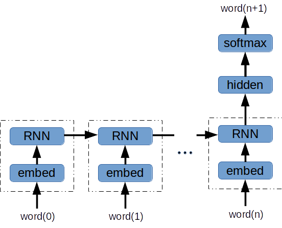
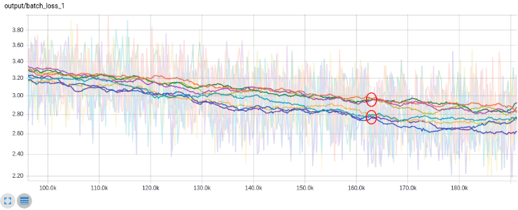
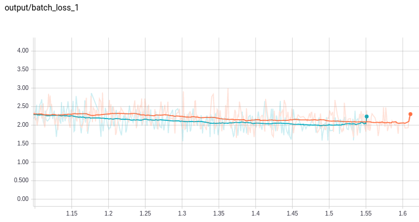
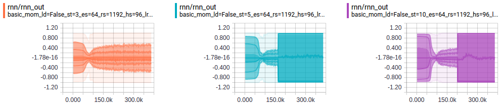
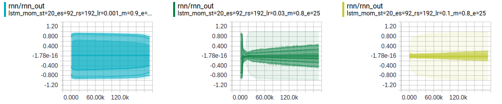
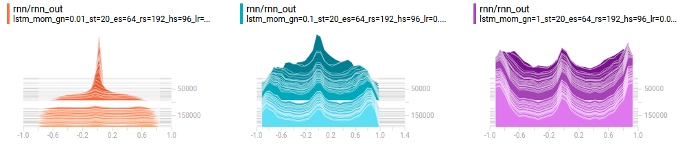

# Objectives

1. Design and train a RNN language model
2. Compare quality of RNN vs. [Continuous Bag-of-Words (CBOW)](https://arxiv.org/pdf/1301.3781.pdf) word vectors
3. Learn TensorBoard

I described the importance of Word Vectors and Unsupervised Learning in my [Word2Vec with TensorFlow Project](https://pat-coady.github.io/word2vec/) - so I won't repeat that here. 

# Architecture

1. Embedding layer between the one-hot word encoding and the RNN
2. RNN: Basic RNN or gated-cell (GRU or LSTM)
3. Hidden layer fed by final RNN output
4. N-way softmax (N = vocabulary size)

With this skeleton in place, there are still many options to explore:

* RNN cell: Basic RNN, LSTM or GRU
* Layer sizes: embedding layer, number RNN cells, hidden layer
* RNN sequence length

I decided at the beginning to learn sequences of words versus sequences of characters. This was partly so I could compare the quality of word vectors from RNNs to CBOW. Also, I wanted to use TensorBoard's embedding visualization. And, finally, I wanted to see how [Candidate Sampling](https://www.tensorflow.org/api_guides/python/nn#Candidate_Sampling) loss would perform with a RNN.

# Training

As with my Word2Vec project, I used 3 Sherlock Holmes books to train the model (courtesy of [Project Gutenberg](https://www.gutenberg.org/)). This choice was convenient since I had already written programs to load and prepare these documents. (In the future I would like to train the model on the New York Times corpus.) 

Training introduces more options (i.e. hyperparameters) to explore. In particular, I investigated:

* Optimizer: SGD w/ momentum, Adam and RMSProp
* Learning rate
* Gradient norm clipping

As with the model hyperparameters, I will explore various settings and summarize the results. As you will see, TensorBoard helps immensely as you explore model settings.

# Results
    
The model results presented here use a LSTM-based RNN that was trained for 75 epochs. Here are the key settings:

    embedding layer width = 64
    rnn width = 192
    rnn sequence length = 20
    hidden layer width = 96
    learning rate = 0.05, momentum = 0.8 (SGD with momentum)
    batch size = 32

## Generated Text

Everyone enjoys reading RNN-generated text:

    where he has not seen."" it is," said holmes," that you have ever
    returned."" i am sure that you are very much in the matter. i have 
    brought you that there is a case between two or two else."" i am
    sure that you are right," said he." i am afraid that you are right
    up before you come and look."" by the way, that is possible, john," 
    said he," that you have had a pretty clear chance. '" 'i am sure when
    my wife died to me - -"" oh, indeed! i was glad that i could not
    get her hand." my dear mr. sherlock holmes, sir, that is my wife,

## Word Vectors

My evaluation of the word vectors is purely qualitative. In that spirit, here are some fun TensorBoard embedding visualizations. This first .gif is an animation of [t-SNE](http://distill.pub/2016/misread-tsne/) running.

(Incidentally, I have found the PCA does quite poorly on this task. Even with a 3rd dimension, it is rare that 2 closely spaced points are related words.)

I ran t-SNE for 350 iterations on the 2,048 most common words (done with the TensorBoard GUI). In this animation I search for a cluster of words. Then I view the words in the cluster to see their relationship - here the relationship is clear:

## RNN vs. CBOW Word Vectors

Here are some synonyms and analogies from the RNN embedding and the CBOW embedding. First the synonyms (based on cosine similarity):

**RNN:**

    5 closest words to: 'run'
    ['walking', 'play', 'knowledge', 'happened', 'engaged']
    5 closest words to: 'mr'
    ['st', 'mrs', 'dr', 'continued', 'above']
    
**CBOW:**

    5 closest words to: 'run'
    ['fall', 'sit', 'go', 'break', 'live']
    5 closest words to: 'mr'
    ['mrs', 'dr', 'st', 'boy', 'message']

Not exactly astounding performance on the synonyms - I could have cherry-picked more compelling examples. The performance on this analogy is more impressive: **"had" is to "has", as "was" is to \_\_\_** :

**RNN:**

    ['is', 'am', 'are']
    
**CBOW:**

    ['is', 'shows', 'becomes']

The RNN word vectors seem *slightly* better. In fairness to CBOW, the RNN was trained 5 times longer.

# Hyperparameters

## Layer Sizes

I started with a LSTM cell and some quick exploration to pick a reasonable optimizer and learning rate. Then I checked a grid of layer sizes: embedding layer, rnn layer (width and number of steps) and final hidden layer.

    embedding layer width = 64
    rnn width = 192
    rnn sequence length = 20
    hidden layer width = 96

At these settings, the model performance was most sensitive to decreasing the hidden layer width. A rnn sequence length of 20 steps is overkill for learning word vectors. Even at a rollout of 5 steps, you learn reasonably good word vectors. But with such a short sequence length the model does a terrible job at generating new text - typically repeating the same few words (e.g. 'it is. it is. it is. it is.')

The lower grouping of training loss curves have a hidden layer size of 96. The upper grouping of curves have a hidden layer size of 64 (The y-axis is cross-entropy loss with 64-way candidate sampling. The x-axis is batch #.):

## Optimizer

I didn't spend as much time evaluating optimizers as I would have liked. But gradient descent with momentum outperformed both Adam and RMSProp for a variety of settings. Both Adam and RMSProp were significantly (about 2x) slower per epoch. And, importantly, made less training progress per epoch.

## RNN Cell

[This post](http://colah.github.io/posts/2015-08-Understanding-LSTMs/) provides a terrific explanation of RNNs and cell types.

### GRU

The GRU cell seems more elegant than the LSTM cell. The same control is used for the input and "forgetting" gates. Also, the cell state and the hidden state are cleverly combined into one (i.e. no separate cell state). You would think this cell would run faster, and even be easier to train. I found in TensorFlow that GRU ran slightly **slower** than the LSTM. The GRU also seemed a bit more sensitive to learning rate.

This plot shows training progress with CPU time on the x-axis (the orange trace is the GRU):

[This paper](https://arxiv.org/pdf/1412.3555v1.pdf) does an in-depth comparison of GRU vs. LSTM. They found mixed performance results. However, their time per epoch is consistently faster with the GRU. So, perhaps there is an implementation issue with the TensorFlow GRUCell?

Both models learned reasonable word vectors, here is a quick qualitative check of the GRU. I like that the model learns that the apostrophe comes **after** the "s" in Holmes.

### Basic RNN

It was no big surprise that the basic RNN cell was very difficult to train. Even with a sequence length of 5, I ran into exploding gradients. Only the orange trace (sequence length = 3) was stable:

Here is another view of the same phenomenom. Here we are looking at the distribution of RNN output activations vs. training step. The sequence lengths are 3, 5 and 10 from left to right:

## Learning Rate

Using gradient descent with momentum, a learning rate between 0.1 and 0.01 performed best (momentum = 0.8). With a small learning rate, the network is too slow to recover from exploding gradients. The below figure shows the distribution of activations in the RNN with learning rates 0.001, 0.01 and 0.1 (from left to right). The left-most plot is just beginning to recover after 25 epochs.

## Gradient Norm Clipping

I decided to add [gradient norm clipping](http://jmlr.csail.mit.edu/proceedings/papers/v28/pascanu13.pdf) after observing exploding gradients while adjusting learning rates. By addressing the exploding gradients head-on, I was hoping to have more flexibility in setting the learning rate.

The 3 plots below show gradient norm clipping levels of 0.01, 0.1 and 1 (from left to right):

These histograms show the distribution of activations in the RNN. The histograms layer "towards you" as training progresses. As expected, the gradient clipping stops the activations from saturating at the beginning of training. But the model still benefits from a higher learning rate. Overall, gradient clipping wasn't particularly helpful.

# [The Code](https://github.com/pat-coady/rnn)

In addition to the python modules described in [my word2vec project](https://github.com/pat-coady/word2vec), there are the following Python Notebooks:

**sherlock_rnn.ipynb**: Configured with the best model configuration and training settings that I found. This notebook:
1. Loads the books
2. Trains for 75 epochs
3. Saves summaries and embeddings for viewing in TensorBoard
4. Uses the RNN to predict 200 words of text

**sherlock_rnn_tune.ipynb**: Notebook for sweeping hyperparameters and comparing results using TensorBoard. 
* layer sizes
* RNN cell type and sequence length
* optimizer and learning rate
* batch_size and more ...

**sherlock_rnn_gradclip.ipynb**: Quick change to sherlock_rnn_tune.ipynb to try gradient norm clipping.

**sherlock_queue.ipynb**: Quick look at using QueueRunner instead of feeddict.

Finally, to launch Tensorboard, just go into the log directory and execute:

    tensorboard --logdir .

I hope this GitHub Page and [associated repository](https://github.com/pat-coady/rnn) help you better understand how to use TensorFlow and TensorBoard. Also, this [blog post](https://pat-coady.github.io/projects/2017/03/09/rnn-and-tensorboard.html) provides a high-level description of this project.



<noscript>Please enable JavaScript to view the <a href="https://disqus.com/?ref_noscript">comments powered by Disqus.</a></noscript>

